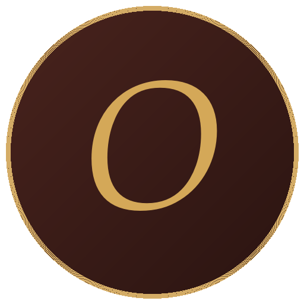
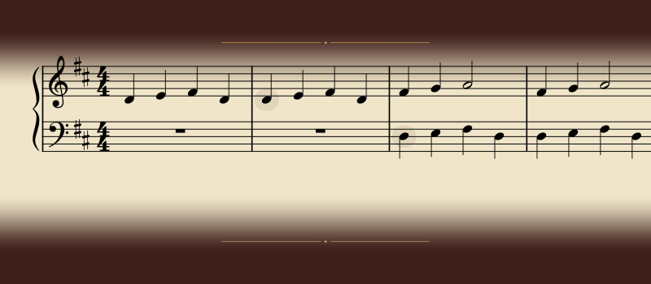

<p align="center">
  
</p>
<h1 align="center">Orchestrion</h1>
<p align="center"><em>Your students play real music — rhythm first.</em></p>



Orchestrion turns any score into an instrument. The player taps the rhythm — on a
MIDI keyboard or the computer keyboard — and Orchestrion plays the notes of the
piece, at the player's own pulse. Pitch accuracy is taken out of the equation, so
kids and beginners experience real repertoire from day one: pulse, phrasing and
musical flow first, note-reading later.

It opens MuseScore (`.mscz`) and MusicXML (`.mxl`, `.musicxml`) files and ships
with a handful of pieces, from *Frère Jacques* to a Chopin nocturne. Built on
[MuseScore](https://musescore.org)'s engraving and playback engine.

**Website: <https://saintmatthieu.github.io/Orchestrion/>**

## Download

Grab the [latest release](https://github.com/saintmatthieu/Orchestrion/releases/latest):

- **Windows** — `.msi` installer (available in English, French and German)
- **macOS** — signed & notarized `.dmg`
- **Linux** — AppImage: `chmod +x Orchestrion-*.AppImage && ./Orchestrion-*.AppImage`

## Building from source

Requirements: CMake, Ninja, Qt 6.9.1 (with the `qtnetworkauth`, `qt5compat`,
`qtscxml` and `qtshadertools` modules), a C++17 compiler, and Git LFS.

```bash
git clone --recurse-submodules https://github.com/saintmatthieu/Orchestrion.git
cd Orchestrion
git lfs pull

cmake -B build -G Ninja \
  -DCMAKE_BUILD_TYPE=RelWithDebInfo \
  -DSMTG_ENABLE_VST3_PLUGIN_EXAMPLES=OFF \
  -DSMTG_ENABLE_VST3_HOSTING_EXAMPLES=OFF \
  -DSMTG_ENABLE_VSTGUI_SUPPORT=OFF

cmake --build build --target install
```

The executable lands in `build/install/bin/`. If CMake configuration fails with
confusing missing-target errors, the submodules are probably missing — run
`git submodule update --init --recursive`.

## License

[GPL-3.0](LICENSE) © 2024 Matthieu Hodgkinson.

Some bundled scores are community engravings — see
[`scores/attributions.json`](scores/attributions.json) for credits.
