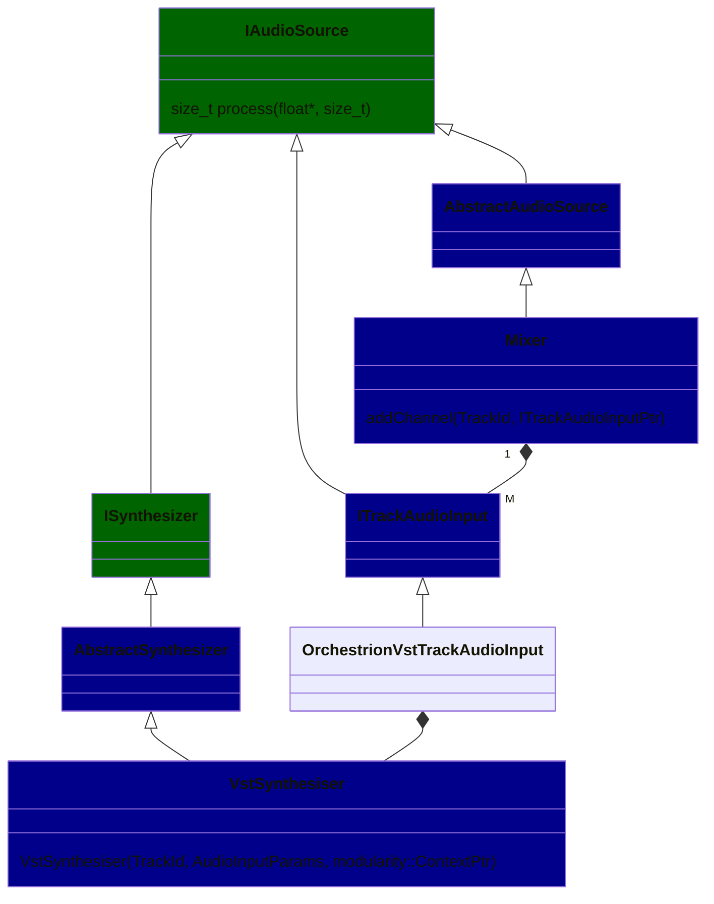

```mermaid
classDiagram


class Mixer:::internal {
    addChannel(TrackId, ITrackAudioInputPtr)
}

class IAudioSource:::public {
    size_t process(float*, size_t)
}
class ITrackAudioInput:::internal
class OrchestrionVstTrackAudioInput
class VstSynthesiser:::internal {
    VstSynthesiser(TrackId, AudioInputParams, modularity::ContextPtr)
}
class AbstractSynthesizer:::internal
class ISynthesizer:::public
class AbstractAudioSource:::internal

IAudioSource <|-- AbstractAudioSource
AbstractAudioSource <|-- Mixer
IAudioSource <|-- ITrackAudioInput
IAudioSource <|-- ISynthesizer
ISynthesizer <|-- AbstractSynthesizer
AbstractSynthesizer <|-- VstSynthesiser
OrchestrionVstTrackAudioInput *-- VstSynthesiser

ITrackAudioInput <|-- OrchestrionVstTrackAudioInput
Mixer "1" *-- "M" ITrackAudioInput

classDef public fill:darkgreen
classDef internal fill:darkblue
```